##MDK进阶使用教程，快捷启动任意软件，自动整理格式化代码，方便代码整理可以很好的提高效率
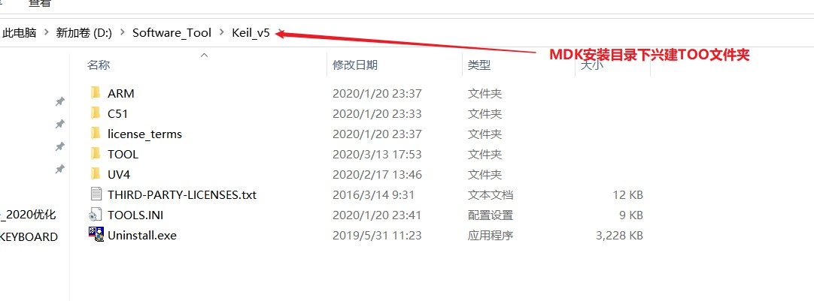
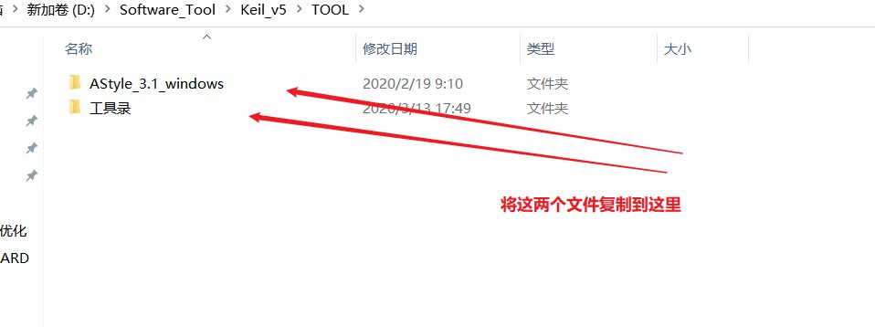
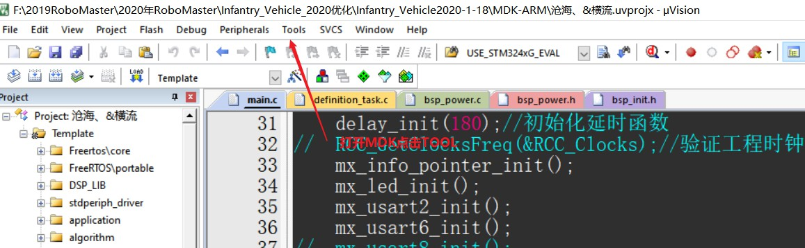
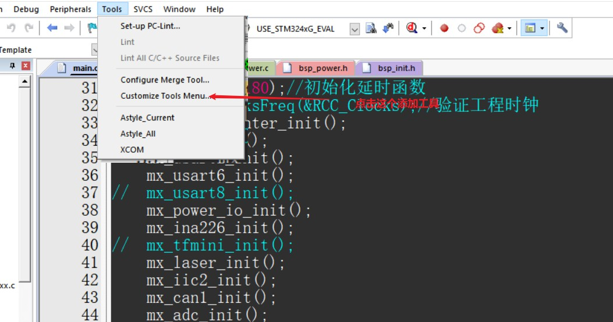
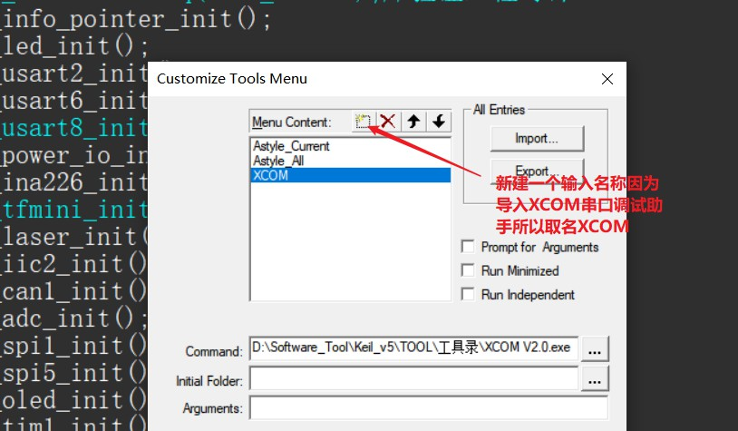
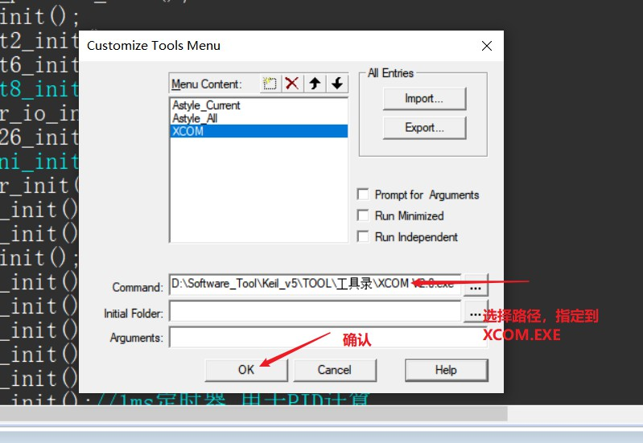
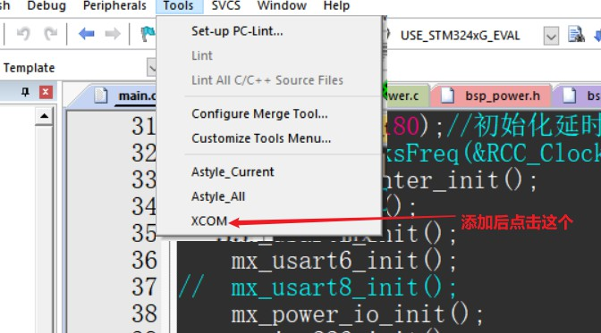

#以下内容才是关键
##AStyle插件
###这款AStyle插件挺好用的，这里也给大家推荐一下。
###代码格式化插件，顾名思义就是格式化代码，简单理解就是对代码进行排版的插件。比如：代码缩进。
###插件下载地址：[http://astyle.sourceforge.net/](http://astyle.sourceforge.net/)
###具体下载安装过程如下
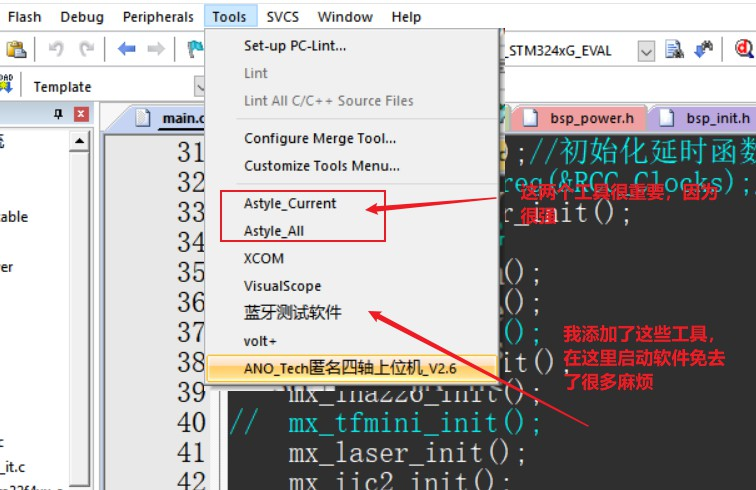

##Astyle_Current 插件输入 ---格式化当前文件
> ##!E --style=gnu --indent=spaces=4
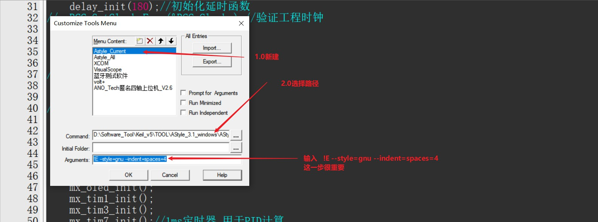

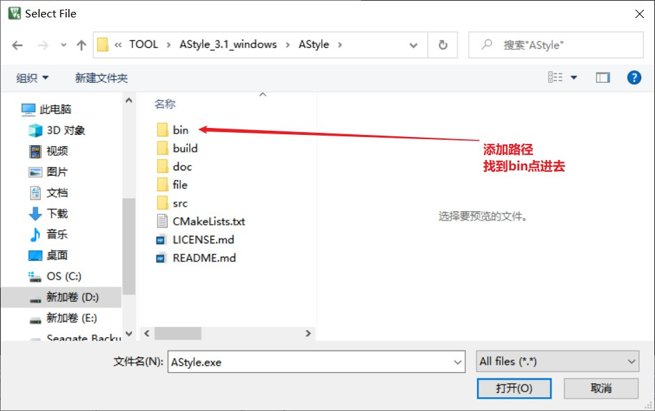
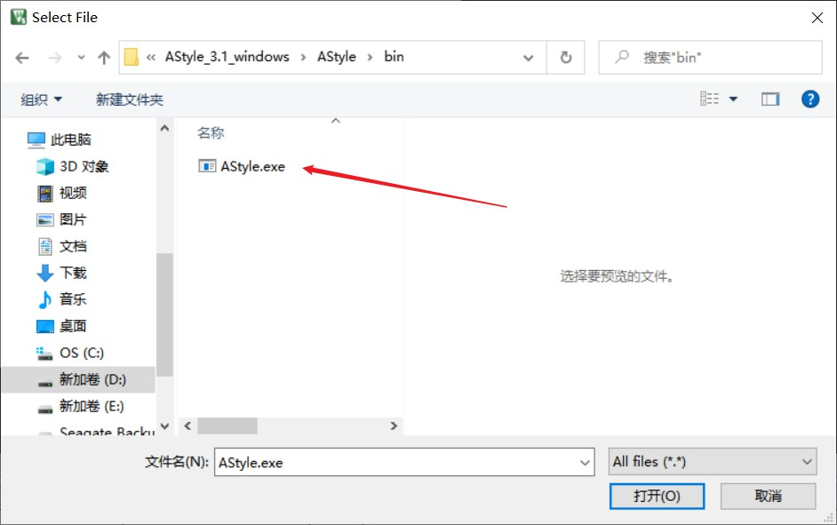
##Astyle_All 插件输入  ---格式化当前文件夹下.c .h
> ##"$E*.c" "$E*.h" --style=gnu --indent=spaces=4
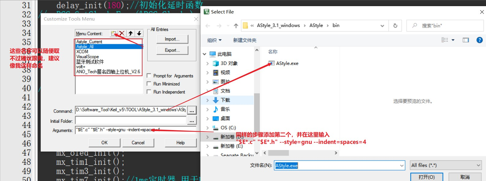

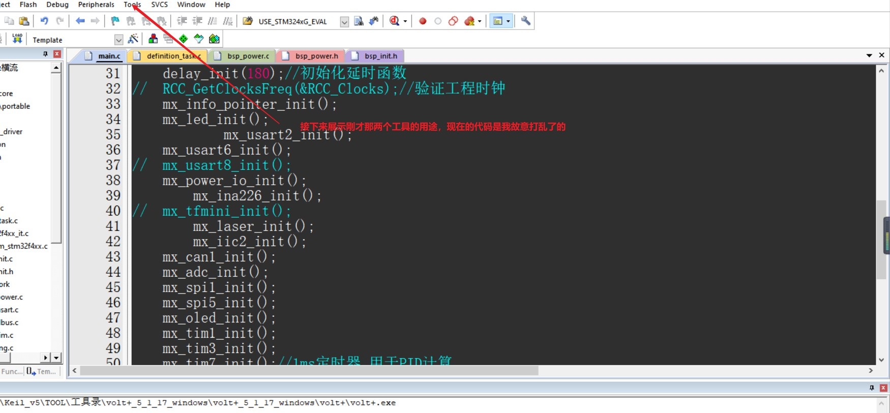
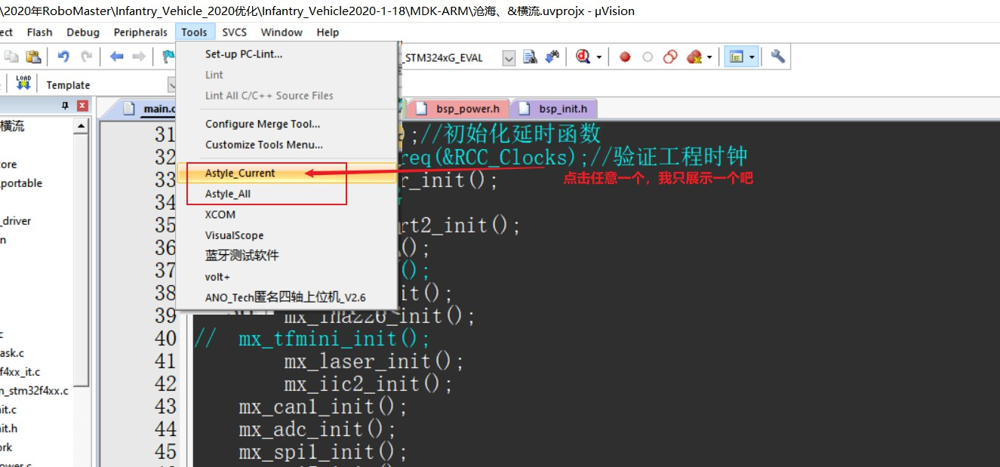
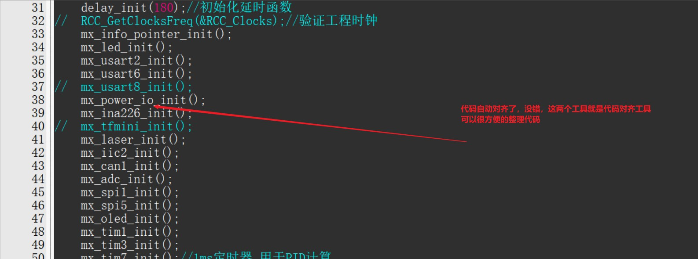
##以上插件具体更多使用教程大家百度自行了解，我这里不过多介绍了
